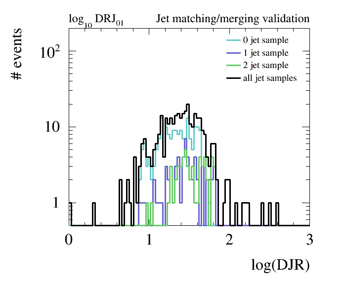
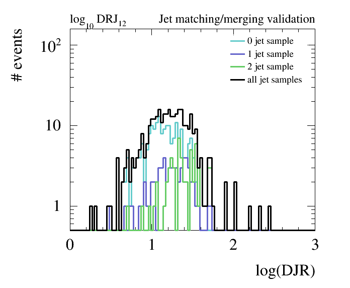

Pythia8 ME/PS validation
========================

The **Parton Shower** (PS) Monte Carlo programs such as Pythia and Herwig describe parton radiation as successive parton 
emissions using Markov chain techniques based on Sudakov form factors. This description is formally correct only in the
**limit of soft and collinear emissions**, but has been shown to give a good description of much data also relatively far 
away from this limit. However, for the production of **hard and widely separated QCD radiation jets**, this description 
breaks down due to the lack of subleading terms and interference. For that case, it is necessary to use the **full 
tree-level amplitudes** for the heavy particle production plus additional hard partons. 

**The aim of any parton-jets matching procedure is mainly to avoid overlapping between phase-space descriptions given 
by matrix-element generators and showering/hadronization softwares in multi-jets process simulation**. The motivation for using both at the same time is the following:
The Matrix Element (ME) description diverges as partons become soft or collinear, while the parton shower description 
breaks down when partons become hard and widely separated. 

The **matching procedure** typically relies on the choice of one or several **parameters** (depending on the approach being used). 
A review of the available approaches in Pythia8 can be found
[here](http://home.thep.lu.se/~torbjorn/pythia81html/MatchingAndMerging.html). 
This is not a lecture on merging, but rather a **simple example to get you started**. 

An example on how to perform PS matching using the **MLM approach** is provided in
```$FCCSW/Generation/data/Pythia\_LHEinput\_matching.cmd```. This Pythia8 configuration uses a previously generated
LHE files containing hard scattered 100 TeV Z+nJets events (with n =0,1,2).

Within FCCSW, run this example: 
```
./run fccrun.py Sim/SimDelphesInterface/options/PythiaDelphes_config.py --inputfile=Generation/data/Pythia_LHEinput_Matching.cmd --nevents=1000

```

To produce matching plots, fetch the [creatingMatchingPlots.py](./creatingMatchingPlots.py) script in this repository,
and run it: 

```
python createMatchingPlots.py fccOutput.root
```





**Note that this example is simply for demonstration. Validation should be performed on at least 50k events.**


The script will produce a bunch of canvas containing the differential jet rates. 
A few guidelines for understanding whether the matching procedure has been done correctly:

   - the matched cross section (for X=0,1,2.. ) is close to the unmatched cross-section for the 0-jets sample
   - the matching scale qCut (in MLM matching) should be Q/6 < qCut < Q/3, where Q is the characteristic hard scale of
   the process
   - the differential jet rate plots should be smooth (meaning that the full jet sample should display no large
   discontinuities)
   - when qCut is varied the matched cross section should not be changed too much

